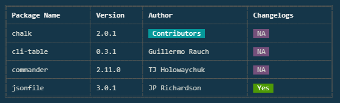

# whatsnew
Shows 'What's new' at all installed package

[](https://www.npmjs.org/package/whatsnew)
[](https://david-dm.org/prattheev/whatsnew/) 
[](https://david-dm.org/prattheev/whatsnew/#info=devDependencies)  

## Install
```
npm install -g whatsnew
```

## Usage
Trigger the `whatsnew` command as a postinstall webhook to your project's `package.json` file.

## Example
`package.json`
```
"scripts": {
    "postinstall": "show-changelog"
}
```
`Output`



## [License](/LICENSE.md)
Copyright (c) 2017 Pratheev <pratheev@email.com>  
This software is licensed under MIT.  

[](/LICENSE.md#mit "Massachusetts Institute of Technology (MIT)")
